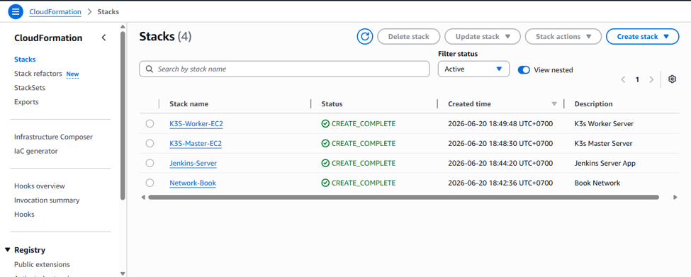
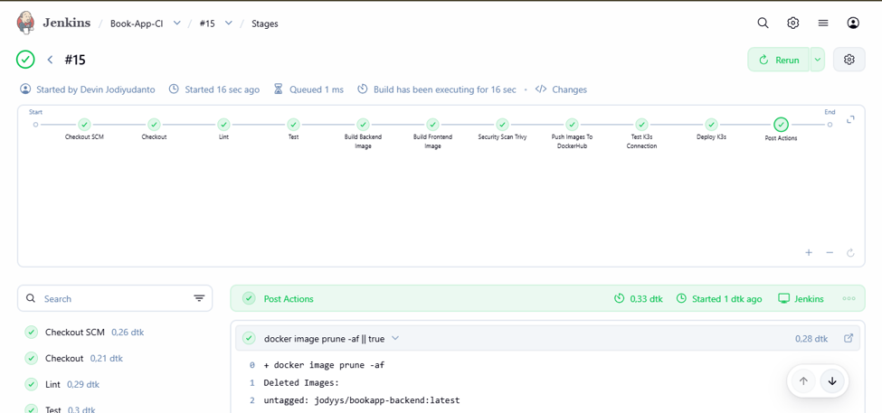
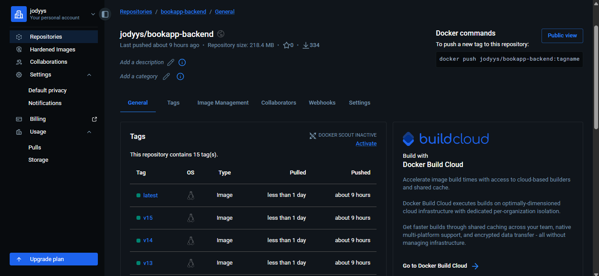
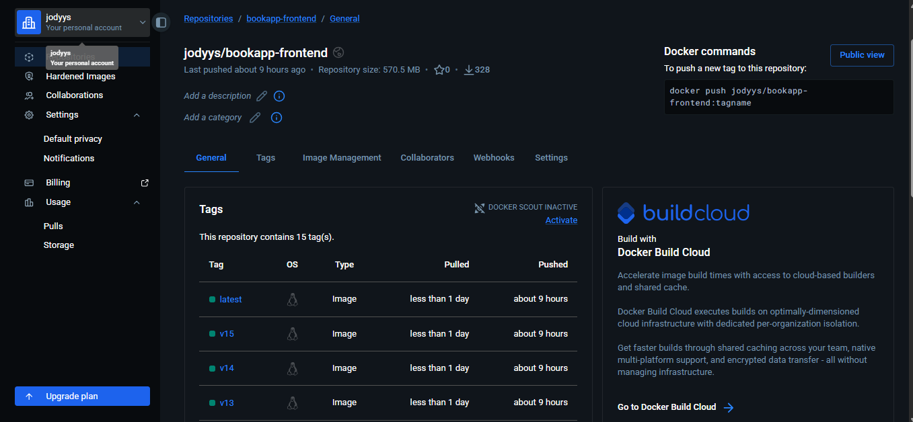
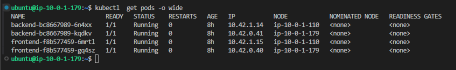
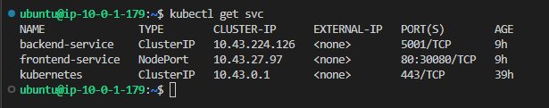
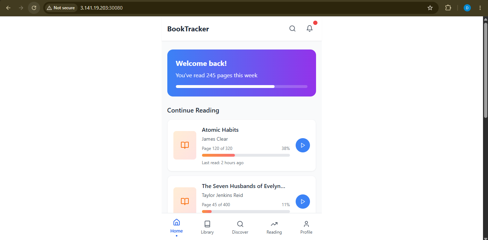
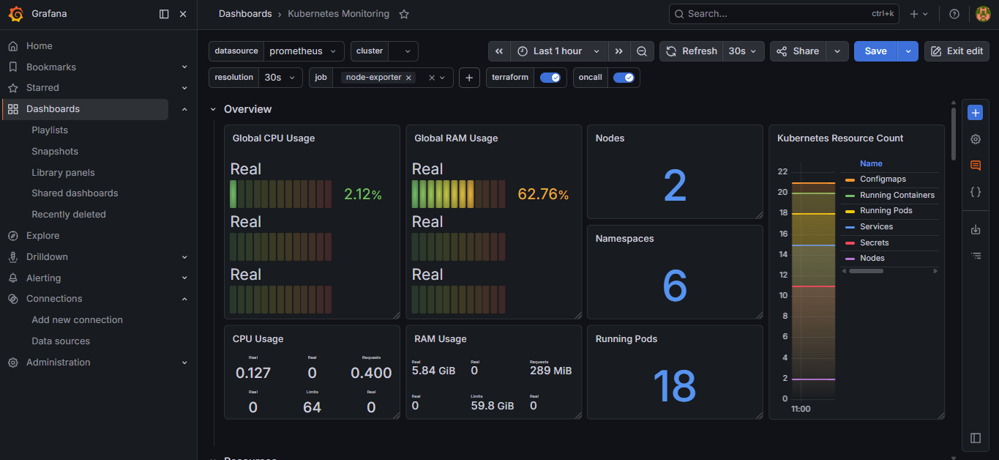
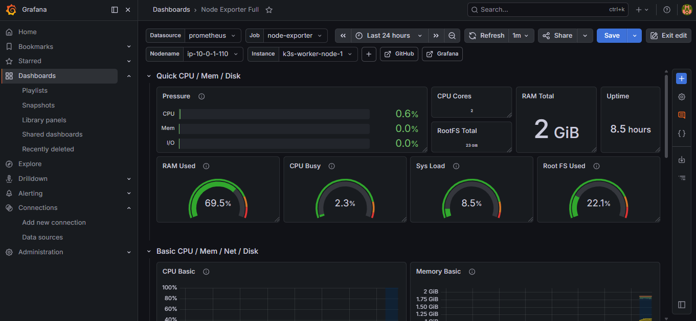
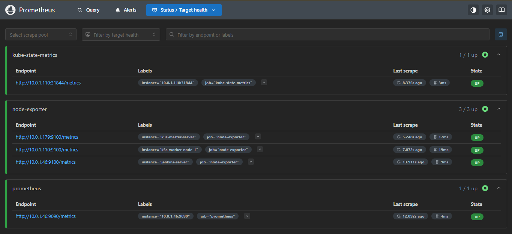

# Track App - End-to-End CI/CD with Jenkins, K3s, Ansible & CloudFormation

## Overview

Track App is a full-stack application that demonstrates an end-to-end DevOps workflow on AWS. The infrastructure is provisioned using AWS CloudFormation, server configuration is automated with Ansible, and the application is built and deployed through a Jenkins CI/CD pipeline to a K3s Kubernetes cluster.

---

## Features

- Infrastructure provisioning with AWS CloudFormation
- Server configuration using Ansible
- Automated CI/CD with Jenkins
- Code linting and testing
- Docker image build
- Container image vulnerability scanning with Trivy
- Docker Hub integration
- Automated deployment to K3s Kubernetes
- Infrastructure monitoring with Prometheus and Grafana

---

## Tech Stack

- AWS CloudFormation
- Ansible
- Jenkins
- GitHub
- Docker
- Docker Hub
- Kubernetes (K3s)
- Trivy
- Prometheus
- Grafana
- PostgreSQL

---

## CI/CD Pipeline

| Stage | Description |
|--------|-------------|
| Checkout SCM | Retrieve source code from GitHub |
| Checkout | Prepare Jenkins workspace |
| Lint | Run code linting |
| Test | Execute automated tests |
| Build Backend Image | Build backend Docker image |
| Build Frontend Image | Build frontend Docker image |
| Security Scan | Scan Docker images using Trivy |
| Push Images to Docker Hub | Push Docker images to Docker Hub |
| Test K3s Connection | Verify Kubernetes cluster connectivity |
| Deploy to K3s | Deploy application to K3s cluster |
| Post Actions | Clean up workspace and Docker images |

---

## Project Workflow

```text
CloudFormation
      │
      ▼
Provision AWS Infrastructure
      │
      ▼
Ansible Configuration
      │
      ▼
GitHub
      │
      ▼
Jenkins
      │
      ├── Lint
      ├── Test
      ├── Build Docker Images
      ├── Trivy Scan
      ├── Push Docker Images
      └── Deploy to K3s
               │
               ▼
      Kubernetes (K3s)
               │
               ▼
 Prometheus & Grafana Monitoring
```

---

## Screenshots

### AWS CloudFormation Stack



---

### Jenkins Pipeline



---

### Docker Hub Repository





---

### Kubernetes Pods



---

### Kubernetes Services



---

### Track App



---
### Grafana Dashboard






---

### Prometheus Targets



---

## Future Improvements

- SonarQube Integration
- Gitleaks Secret Scanning
- GitOps with ArgoCD